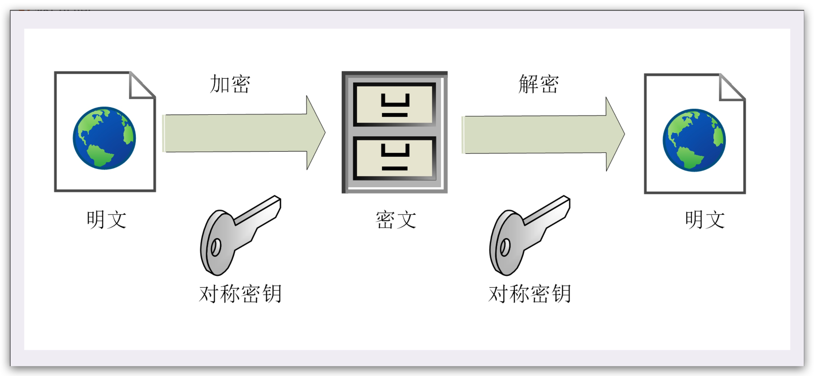
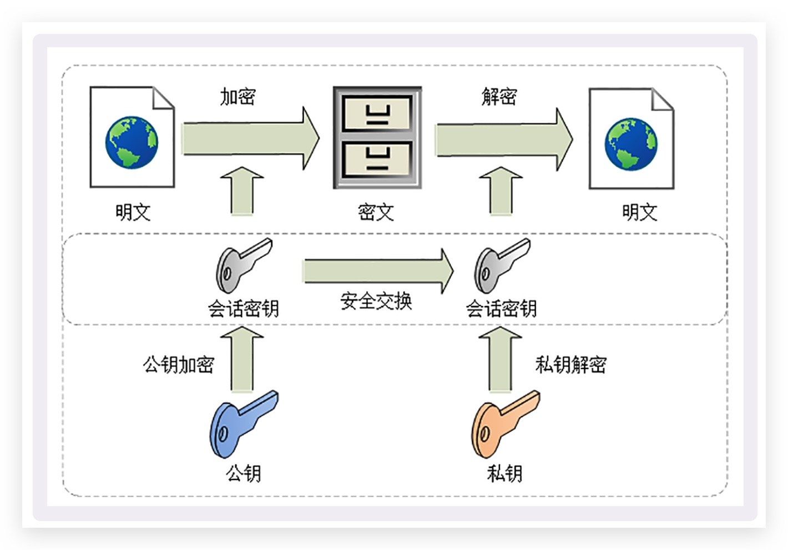

## 说说对称加密和非对称加密的理解

- 加密含义
- 对称加密：相同秘钥（快）
- 非对称加密：公钥和私钥（慢）
- 混合加密: TLS 通信采用的方式

### 加密含义

实现机密性最常用的手段是“加密”（encrypt），把消息用某种方式转换成谁也看不懂的乱码，只有掌握特殊“钥匙”的人才能再转换出原始文本。这里的“钥匙”就叫做“密钥”（key），加密前的消息叫“明文”（plain text/clear text），加密后的乱码叫“密文”（cipher text），使用密钥还原明文的过程叫“解密”（decrypt），是加密的反操作，加密解密的操作过程就是“加密算法”。

按照密钥的使用方式，加密可以分为两大类：对称加密和非对称加密。

### 对称加密算法

“对称加密”很好理解，就是指加密和解密时使用的密钥都是同一个，是“对称”的。只要保证了密钥的安全，那整个通信过程就可以说具有了机密性。

TLS 里有非常多的对称加密算法可供选择，比如 RC4、DES、3DES、**AES**、ChaCha20 等，但前三种算法都被认为是不安全的，通常都禁止使用，目前常用的只有 AES 和 ChaCha20。

> AES 的意思是“高级加密标准”（Advanced Encryption Standard），密钥长度可以是 128、192 或 256。它是 DES 算法的替代者，安全强度很高，性能也很好，而且有的硬件还会做特殊优化，所以非常流行，是应用最广泛的对称加密算法。
> ChaCha20 是 Google 设计的另一种加密算法，密钥长度固定为 256 位，纯软件运行性能要超过 AES，曾经在移动客户端上比较流行，但 ARMv8 之后也加入了 AES 硬件优化，所以现在不再具有明显的优势，但仍然算得上是一个不错的算法。

对称加密看上去好像完美地实现了机密性，但其中有一个很大的问题：**如何把密钥安全地传递给对方? (“密钥交换”)**

因为在对称加密算法中只要持有密钥就可以解密，如果你和网站约定的密钥在传递途中被黑客窃取，那他就可以在之后随意解密收发的数据，通信过程也就没有机密性可言.

> 肯定不能鸡生蛋蛋生鸡，因此有了非对称加密算法

### 非对称加密算法

它有两个密钥，一个叫“公钥”（public key），一个叫“私钥”（private key）。两个密钥是“不对称”的，公钥可以公开给任何人使用，而私钥必须严格保密。

公钥和私钥有个特别的“单向”性，虽然都可以用来加密解密，但公钥加密后只能用私钥解密，反过来，私钥加密后也只能用公钥解密。

非对称加密可以解决“密钥交换”的问题。网站秘密保管私钥，在网上任意分发公钥，你想要登录网站只要用公钥加密就行了，密文只能由私钥持有者才能解密。而黑客因为没有私钥，所以就无法破解密文。

很遗憾，虽然非对称加密没有“密钥交换”的问题，但因为它们都是基于复杂的数学难题，运算速度很慢，如果仅用非对称加密，虽然保证了安全，但**通信速度有如乌龟**,实用性就变成了零。

> RSA:非对称加密的代名词，基于大数分解的数学难题； ECDHE：椭圆曲线加密算法，比 RSA 算法更安全，TLS1.3 握手是基于 ECDHE 算法，TLS1.2 可选该算法作为加密套件

### 混合加密

在通信刚开始的时候使用非对称算法比如 ECDHE,首先解决**密钥交换**的问题。然后用随机数产生对称算法使用的“**会话密钥**”（session key），再用公钥加密。

因为会话密钥很短，所以慢一点也无所谓。对方拿到密文后用**私钥**解密，取出会话密钥。这样，双方就实现了**对称密钥**的安全交换，后续就**不再使用非对称加密**，全都使用**对称加密**。

这样混合加密就解决了对称加密算法的密钥交换问题，而且安全和性能兼顾，完美地实现了机密性。

### 提炼

1. 对称加密只使用一个密钥，运算速度快，密钥必须保密，无法做到安全的密钥交换，常用的有 AES 和 ChaCha20；
2. 非对称加密使用两个密钥：公钥和私钥，公钥可以任意分发而私钥保密，解决了密钥交换问题但速度慢，常用的有 RSA 和 ECHDE;
3. 把对称加密和非对称加密结合起来就得到了“又好又快”的混合加密，也就是 TLS 里使用的加密方式。
